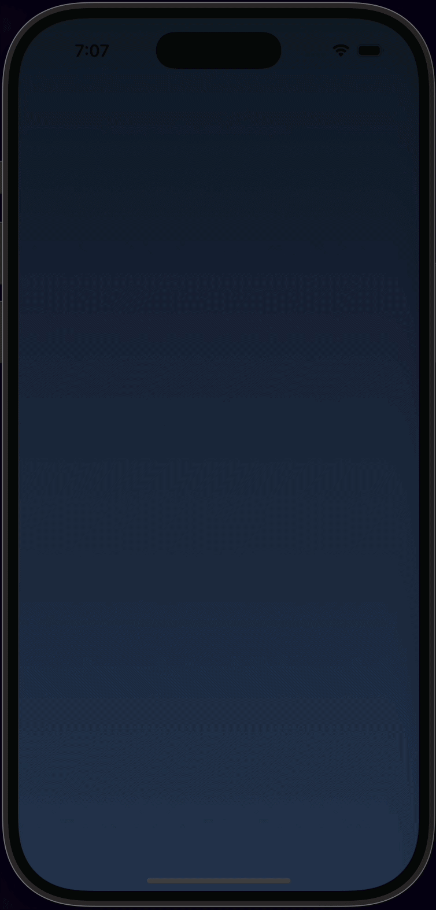
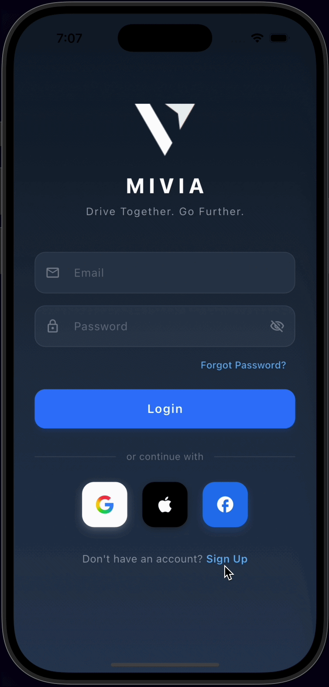

# MIVIA Prototype

Welcome to the prototype repository for **MIVIA** - *Built for the Journey Ahead*.

MIVIA is the ultimate road trip companion. Plan scenic drives, discover amazing routes, and connect with fellow drivers. Built for those who live for the drive.

This is sample prototype of MIVIA: [https://getmivia.app/](https://getmivia.app/)

## Prototype Showcase

Here are some glimpses of the current prototype in action:

<table>
  <tr>
    <td align="center"><b>Splash Screen</b></td>
    <td align="center"><b>Authentication</b></td>
    <td align="center"><b>Home Screen</b></td>
  </tr>
  <tr>
    <td></td>
    <td></td>
    <td></td>
  </tr>
</table>

## Future Directions

As we continue to develop and expand MIVIA, we are looking into adding the following features:

- 🎵 **Road Condition Based Music:** Dynamically curating music playlists that match the current driving mood and road conditions.
- 🚗 **Apple CarPlay Integration:** Deep integration with car infotainment systems for a seamless driving experience using Apple CarPlay.
